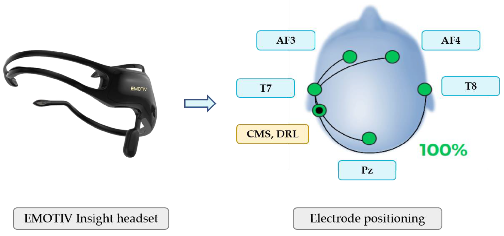
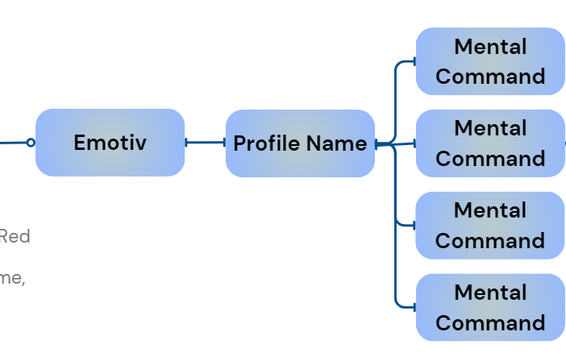
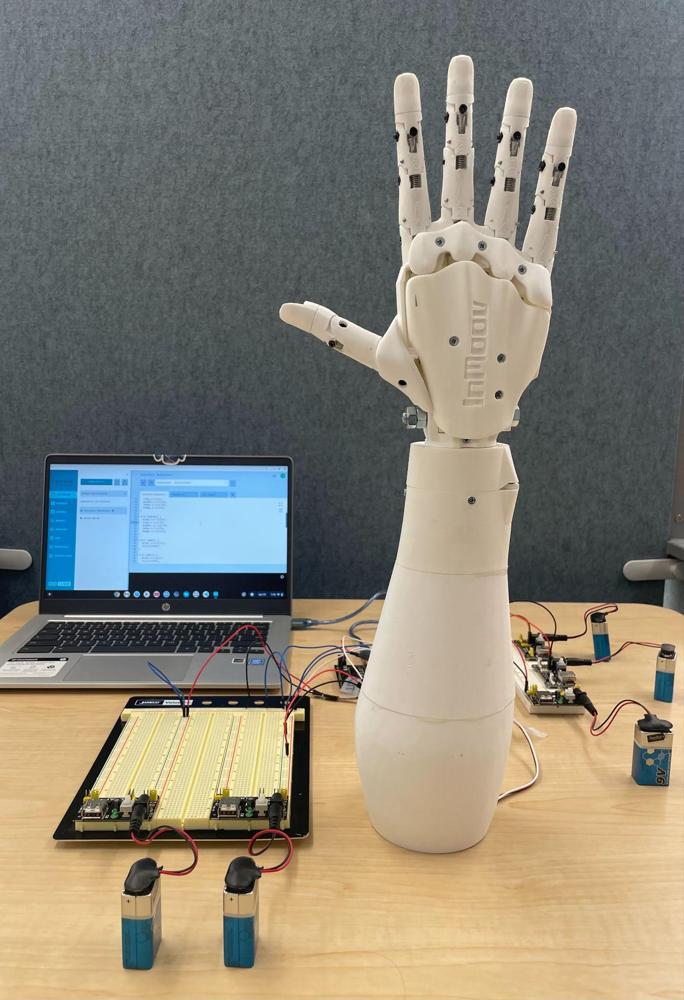

# Neuro-Prosthetic EEG Controlled Robotic Arm 
## Neurotech@Davis
Data Collection Team: Abrianna Johnson, Avni Bafna (@AvniBafna), Deiva Dham, Grace Lim, Matangi Venkatakrishnan (@MatVenkat)

Hardware Team: Adit Jain, Dhruv Sangamwar (@dhruvsangamwar), Evan Silvey (@EvanSilvey)

Software Team: Ahmed Seyam (@AhmedSey03), Prakhar Sinha (@prakhargaming), Priyal Patel (@priyalpatell)

## Introduction

Our project utilizes rhythmic patterns associated with the waveforms for each mental command. This is accompanied by the mental imagery of the task, which can be explained by utilizing mirror neurons for the motor-related tasks. A baseline for these commands is computed using the recorded “neutral” state, where the subject does not imagine stimulus. All commands are recorded from the same channels shown below on our EEG headset. The user trains the commands to associate with robotic arm movements, individualizing their own mental commands.

## Methods

- The onset of the stimuli began approximately 5 seconds before the training recording, giving the subject time to be primed and form a mental image of the task. 
- Each recording of a mental command lasted for 7 seconds after the stimuli was presented. Following each presentation, the subject had to decide whether to accept or reject that training session based on their confidence in their mental imagery of the task.
- During the neutral state, the subject refrained from making any association with the mental commands. 
- Commands were added consecutively after one another, enabling the subject to gain confidence in each task before training a new command.
 
## Commands
- The "grab" command was primed with a video depicting the slow, low-arousal action of lifting the subject’s phone. 
- The "left" command was primed with a video showing the slow, low-arousal movement of the subject’s water bottle to the left. 
- The "right" command was primed with a video portraying a fast, high-arousal stabbing motion with a pen to the right. 
- The "drop" command was primed with a video featuring a cartoon piano falling down, eliciting fast, high-arousal responses.

## Pipeline
Using the built-in integration of Emotiv’s software with the Node-Red toolbox, we seek to in real-time detect 4 mental commands—lift, drop, left, and right—using a threshold in the range of 70-90; we will need to complete more fine-tuning to establish specific cutoffs for each command. The final integer output will be sent through a serial connection with the Arduino. The integer output for each command is 1 for lift, 2 for drop, 3 for left, and 4 for right.

## Results/Conclusion

We use the Elegoo UNO R3 microcontroller with the Arduino IDE to manage the hardware. Servo Motors are used for the movement of fingers and the wrist. A serial connection is established between software and hardware to relay mental commands from the Emotiv Headset to the servo motors. Fishing line is connected to the pulley system and servo motors to control tension and when the fingers should grab. The Arduino IDE uploads the necessary program to control the hardware using mental command inputs. A USB connection is made from the Elegoo Uno R3 to the computer running the Node-Red software. This establishes the software to hardware connection through the serial port connection. Upon a valid mental command, specific servo motors associated with the command will activate to represent the instruction via the 3D printed hand

## References

- Bahy, M. M. E., Hosny, M., Mohamed, W. A., & Ibrahim, S. (1970, January 1). EEG signal classification using neural network and support vector machine in Brain Computer Interface. SpringerLink. https://link.springer.com/chapter/10.1007/978-3-319-48308-5_24
- Emotiv EEG cloud - mobile and secure EEG Cloud Database. EMOTIV. (n.d.). https://www.emotiv.com/emotiv-eeg-cloud/
- Mwata-Velu, T., Ruiz-Pinales, J., Rostro-Gonzalez, H., Ibarra-Manzano, M. A., Cruz-Duarte, J. M., & Avina-Cervantes, J. G. (2021, March 12). Motor imagery classification based on a recurrent-convolutional architecture to control a hexapod robot. MDPI. https://www.mdpi.com/2227-73
- Planelles, D., Hortal, E., Costa, A., Ubeda, A., Iáez, E., & Azorín, J. M. (2014, September 29). Evaluating classifiers to detect arm movement intention from EEG Signals. Sensors (Basel, Switzerland). https://www.ncbi.nlm.nih.gov/pmc/articles/PMC4239925/
- Zhang, K., Xu, G., Han, Z., Ma, K., Zheng, X., Chen, L., Duan, N., & Zhang, S. (2020, August 11). Data augmentation for motor imagery signal classification based on a hybrid neural network. Sensors (Basel, Switzerland). https://www.ncbi.nlm.nih.gov/pmc/articles/PMC7474427/ 
- J. del R Millan et al.. (2002, May). A Local Neural Classifier for the Recognition of EEG Patterns Associated to Mental Tasks. Retrieved April 10, 2024, from https://ieeexplore.ieee.org/abstract/document/1000132
- InMoov (n.d.). Hand i2. Retrieved April 10, 2024, from https://inmoov.fr/hand-i2/